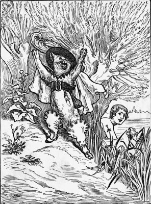

#Puss With Boots
Once upon a time there was a miller who left no more riches to the three sons he had than his mill, his ass, and his cat. The division was soon made. Neither the lawyer nor the attorney was sent for. They would soon have eaten up all the poor property. The eldest had the mill, the second the ass, and the youngest nothing but the cat.

The youngest, as we can understand, was quite unhappy at having so poor a share.

"My brothers," said he, "may get their living handsomely enough by joining their stocks together; but, for my part, when I have eaten up my cat, and made me a muff of his skin, I must die of hunger."

The Cat, who heard all this, without appearing to take any notice, said to him with a grave and serious air:—

"Do not thus afflict yourself, my master; you have nothing else to do but to give me a bag, and get a pair of boots made for me, that I may scamper through the brambles, and you shall see [Pg 46]that you have not so poor a portion in me as you think."

Though the Cat's master did not think much of what he said, he had seen him play such cunning tricks to catch rats and mice—hanging himself by the heels, or hiding himself in the meal, to make believe he was dead—that he did not altogether despair of his helping him in his misery. When the Cat had what he asked for, he booted himself very gallantly, and putting his bag about his neck, he held the strings of it in his two forepaws, and went into a warren where was a great number of rabbits. He put bran and sow-thistle into his bag, and, stretching out at length, as if he were dead, he waited for some young rabbits, not yet acquainted with the deceits of the world, to come and rummage his bag for what he had put into it.

Scarcely was he settled but he had what he wanted. A rash and foolish young rabbit jumped into his bag, and Monsieur Puss, immediately drawing close the strings, took him and killed him at once. Proud of his prey, he went with it to the palace, and asked to speak with the King. He was shown upstairs into his Majesty's apartment, and, making a low bow to the King, he said:—

"I have brought you, sire, a rabbit which my noble Lord, the Master of Carabas" (for that was [Pg 47]the title which Puss was pleased to give his master) "has commanded me to present to your Majesty from him."

"Tell thy master," said the King, "that I thank him, and that I am pleased with his gift."

Another time he went and hid himself among some standing corn, still holding his bag open; and when a brace of partridges ran into it, he drew the strings, and so caught them both. He then went and made a present of these to the King, as he had done before of the rabbit which he took in the warren. The King, in like manner, received the partridges with great pleasure, and ordered his servants to reward him.

The Cat continued for two or three months thus to carry his Majesty, from time to time, some of his master's game. One day when he knew that the King was to take the air along the riverside, with his daughter, the most beautiful princess in the world, he said to his master:—

"If you will follow my advice, your fortune is made. You have nothing else to do but go and bathe in the river, just at the spot I shall show you, and leave the rest to me."

The Marquis of Carabas did what the Cat advised him to, without knowing what could be the use of doing it. While he was bathing, the King passed by, and the Cat cried out with all his might:—

[Pg 48]

"Help! help! My Lord the Marquis of Carabas is drowning!"

At this noise the King put his head out of the coach window, and seeing the Cat who had so often brought him game, he commanded his guards to run immediately to the assistance of his Lordship the Marquis of Carabas.

While they were drawing the poor Marquis out of the river, the Cat came up to the coach and told the King that, while his master was bathing, there came by some rogues, who ran off with his clothes, though he had cried out, "Thieves! thieves!" several times, as loud as he could. The cunning Cat had hidden the clothes under a great stone. The King immediately commanded the officers of his wardrobe to run and fetch one of his best suits for the Lord Marquis of Carabas.

<!-- ---
slug: "/third-post"
date: "2019-2-5"
title: "Our third Post"
path: "/third-post"
--- -->
<!--
#Puss With Boots drawing

 -->